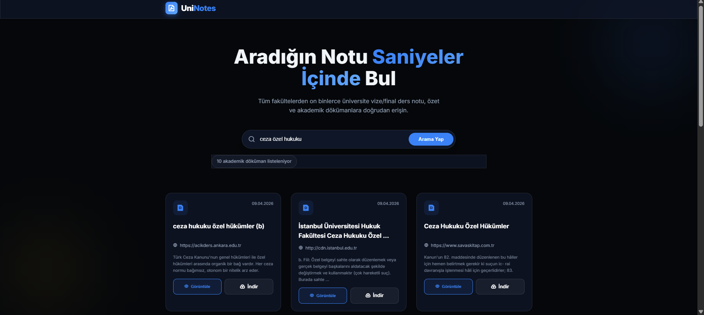

# 🎓 UniNotes - Modern Üniversite PDF Arama Motoru

UniNotes, üniversite öğrencilerinin ders notlarına, özetlere ve akademik dökümanlara saniyeler içinde ulaşmasını sağlayan modern, hızlı ve açık kaynaklı bir arama platformudur. Google arama motorunun gücünü kullanarak internet üzerindeki sadece akademik PDF dosyalarını tarar ve size reklamsız, temiz bir listeleme sunar.



## ✨ Öne Çıkan Özellikler

- **🔍 Hassas PDF Filtreleme:** Sadece `.pdf` uzantılı ve üniversite kaynaklı dökümanları listeler.
- **👁️ Anında Önizleme:** Google Docs Viewer entegrasyonu ile dosyaları indirmeden tarayıcıda görüntüleyin.
- **📱 Kesintisiz Responsive Deneyim:** Mobil cihazlarda kusursuz çalışan, modern ve premium karanlık tema.
- **⚡ Işık Hızında Performans:** Node.js backend ve optimize edilmiş vanilya JS frontend.
- **🌊 Glassmorphism Tasarım:** Modern UI trendlerine uygun, göz yormayan şeffaf arayüz.

## 🚀 Hızlı Kurulum

Projeyi kendi bilgisayarınızda çalıştırmak için aşağıdaki adımları takip edin:

### 1. Hazırlık
Bu depoyu klonlayın veya zip olarak indirin:
```bash
git clone https://github.com/omerbozkurt/uninotes.git
cd UniNotes
```

### 2. Bağımlılıkları Yükleyin
```bash
npm install
```

### 3. Yapılandırma
`.env.example` dosyasını kopyalayarak bir `.env` dosyası oluşturun:
- [SerpApi](https://serpapi.com/) üzerinden ücretsiz bir API anahtarı alın.
- `.env` dosyasını açın ve anahtarınızı ekleyin:
```env
SERPAPI_KEY=api_anahtariniz_buraya
PORT=3000
```

### 4. Başlatın
Sistemi ayağa kaldırın:
```bash
npm start
```
Tarayıcınızda `index.html` dosyasını açarak kullanmaya başlayın!

## 🛠️ Teknik Mimari

- **Backend:** [Node.js](https://nodejs.org/) & [Express](https://expressjs.com/)
- **Frontend:** HTML5, CSS3 (Custom Properties & Glassmorphism), Vanilla JavaScript
- **API:** [SerpApi](https://serpapi.com/) (Google Search Engine)
- **Tasarım:** Remix Icons & Inter Font Family

## 🤝 Katkıda Bulunma

Bu proje açık kaynaklıdır! Katkıda bulunmak isterseniz:
1. Depoyu forklayın.
2. Yeni bir feature branch oluşturun (`git checkout -b feature/yeniozellik`).
3. Değişikliklerinizi commit edin (`git commit -m 'Yenilik eklendi'`).
4. Branch'inizi push edin (`git push origin feature/yeniozellik`).
5. Bir Pull Request açın.

## 📄 Lisans

Bu proje [MIT Lisansı](LICENSE) ile lisanslanmıştır. Daha fazla bilgi için LICENSE dosyasına göz atabilirsiniz.

---
*Geleceğin notlarını bugünden keşfedin. - UniNotes*
